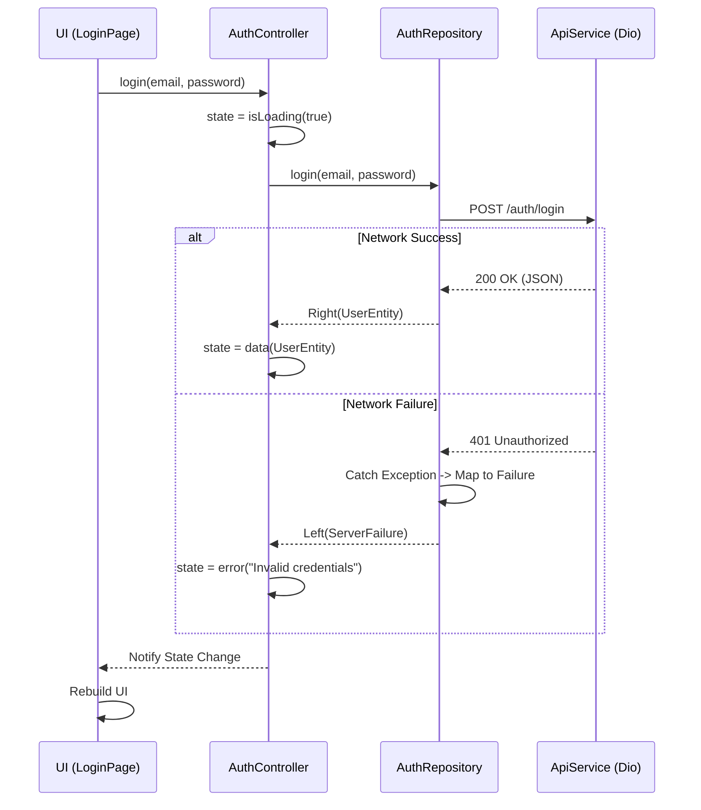

# Flutter Enterprise Template 🚀

[](https://github.com/rmValdez/mapanytime_market_app/actions/workflows/flutter_ci.yml)

A strictly enforced Flutter frontend architecture system designed for predictable scaling, enforced consistency, and long-term team maintainability.

---

## ⚠️ System Classification

This is not a starter template.

This repository is a **frontend architecture enforcement system** that defines:
- how features are structured
- how state is managed
- how errors are handled
- how UI consistency is enforced
- how code is validated before merge

---

## 🏢 System Ownership

This architecture is maintained as an engineering standard.

All contributions must comply with the rules defined in this document.

Any deviation must be explicitly reviewed and approved through code review.

> 📖 **Read the Handbook:** For the comprehensive list of rules, anti-patterns, and layer responsibilities, read the **[Engineering Handbook](docs/Framework-Guide/engineering-handbook.md)**.
> 💡 **New to this project?** Read the **[Getting Started Guide](docs/Framework-Guide/getting_started.md)** to set up your environment.

---

## 🧠 Why This System Exists

Most Flutter applications fail at scale due to **lack of enforced structure**, not lack of features.

As teams grow, common issues appear:
- inconsistent state management across features
- uncontrolled exception handling in UI layers
- duplicated UI logic and styling drift
- tightly coupled networking code
- untestable business logic flows

This system reduces these failure modes through a mix of **tooling-enforced** and **convention-enforced** guarantees. Be honest about which is which:

| Mechanism | Enforced by | Auto-blocked in CI? |
|---|---|---|
| Functional error modeling (fpdart `Either`) | Type system + review | Partially (must compile) |
| Strict linting (`very_good_analysis`) | `flutter analyze` | ✅ Yes |
| Formatting | `dart format` | ✅ Yes |
| Tests pass | `flutter test` | ✅ Yes |
| No cross-feature imports | CI guard script | ✅ Yes (except `auth`) |
| Design-system tokens (no ad-hoc UI values) | Convention + review | ❌ No (review only) |
| No API calls / raw HTTP in UI | Convention + review | ❌ No (review only) |

> The architectural *boundaries* below are real and expected, but only the rows marked ✅ are mechanically enforced today. The rest rely on code review. Treat them as standards, not guarantees.

---

## 🚫 Non-Negotiable Rules

These rules are enforced at architecture level:

- **No API calls inside UI layer**
- **No unhandled exceptions in presentation layer**
- **No hardcoded spacing, colors, or typography**
- **No cross-feature imports** *(except the shared `auth`/session feature — see Handbook §2.4)*
- **No raw HTTP usage outside ApiService**
- **No state mutation outside Riverpod controllers**

---

## 🔐 Compliance Enforcement

Violations of these rules are treated as architectural regressions.

Examples of violations:
- bypassing the ApiService layer
- introducing untyped error handling
- adding UI logic outside presentation boundaries
- bypassing design system components

All violations must be resolved before merge approval.

---

## 📊 Core Architecture

Code is grouped by **Feature** (`auth`, `home`), not by type (`controllers`, `repositories`).

```mermaid
graph TD
    subgraph Feature [Feature: Auth]
        UI[Presentation Layer\n(Pages, Widgets)]
        Controller[Controller Layer\n(Riverpod Notifier)]
        Domain[Domain Layer\n(Interfaces, Entities)]
        Data[Data Layer\n(Repositories, DTOs)]
    end
    
    API[Core Services\n(Dio ApiService)]
    
    UI -->|User Input| Controller
    Controller -->|Calls| Domain
    Domain -.->|Implemented by| Data
    Data -->|HTTP Request| API
    
    style Feature fill:#f9f9f9,stroke:#333,stroke-width:2px
    style UI fill:#d1e7dd,stroke:#0f5132
    style Controller fill:#cff4fc,stroke:#055160
    style Domain fill:#fff3cd,stroke:#664d03
    style Data fill:#f8d7da,stroke:#842029
```

---

## 🔁 The Request Lifecycle

When a user interacts with the UI, the data flows in a strict, unidirectional path. Here is exactly how the Auth flow operates:



---

## 🎯 Feature Walkthrough: The "Either" Pattern

Our strongest feature is how we handle errors. We completely avoid `try/catch` blocks in the UI layer.

### ❌ What NOT to do (Raw Exceptions)
```dart
// Bad: The UI might crash if a developer forgets a try/catch
onPressed: () async {
  try {
    await api.login(email, password);
  } catch (e) {
    showError("Network error");
  }
}
```

### ✅ The Enterprise Way (fpdart)
Our Repositories return an `Either<Failure, Success>`. Errors become *values*, so the failure path is part of the function's type rather than an exception that can slip past an empty `catch`. The Controller handles both sides with `.fold()`:

```dart
// Inside AuthController
final result = await _repository.login(email, password);

result.fold(
  // Left: A strictly typed Failure object
  (failure) => state = state.copyWith(isLoading: false, error: failure.message),
  // Right: The successful Entity
  (user) => state = state.copyWith(isLoading: false, user: user, error: null),
);
```

---

## ⚙️ CI/CD Enforcement Layer

This system enforces quality as a **hard gate, not a guideline**.

On every **Pull Request** and **Push to Main**, GitHub Actions will automatically:
1. **Setup Flutter**: Caches the SDK for blazing-fast builds.
2. **Generate Localization**: Runs `flutter gen-l10n`.
3. **Format Check**: Runs `dart format` to ensure strict syntax styling. (Fails the build if unformatted).
4. **Lint Gate**: Runs `flutter analyze` to catch unused imports and bad practices. (Fails the build if issues exist).
5. **Feature Isolation Gate**: A guard script fails the build if a feature imports another feature's code (the shared `auth` feature is exempt).
6. **Test Gate**: Runs `flutter test` across the entire project. (Fails the build if tests fail).

*Violations of the gates above cannot reach the main branch by design. Conventions not on this list (design tokens, no-API-in-UI) are enforced by code review, not CI.*

---

## 🎨 Design System Enforcement

UI consistency is not optional in this system. All visual structure is controlled through a centralized design token system and shared components.

### Spacing Tokens
Always use `AppSpacing` for margins, padding, and gaps:
```dart
// Bad
SizedBox(height: 16);
Padding(padding: EdgeInsets.all(24));

// Good (Enterprise standard)
AppSpacing.gapMd;
Padding(padding: AppSpacing.edgeInsetsLg);
```

### Concrete Component Usage
Use the pre-built shared widgets located in `lib/shared/widgets/` to ensure the entire app remains visually consistent:

```dart
// 1. AppInput (Standardized Text Fields)
AppInput(
  label: context.l10n.email,
  controller: _emailController,
  prefixIcon: Icons.email_outlined,
  validator: Validators.email, // Built-in regex validators
)

// 2. AppButton (State-aware Material 3 Buttons)
AppButton(
  label: context.l10n.login,
  isLoading: state.isLoading, // Automatically shows a spinner when true
  onPressed: _submit,
)
```

---

## 🧪 Testing & The AAA Pattern

Tests must be highly readable and predictable. We enforce the **AAA Pattern (Arrange, Act, Assert)** for all Riverpod Controller tests.

```dart
test('login success updates state with user', () async {
  // 1. ARRANGE
  // Setup the mock repository to return a successful Right(User)
  when(() => mockRepository.login(any(), any()))
      .thenAnswer((_) async => Right(testUser));

  // 2. ACT
  // Trigger the actual function we are testing
  final result = await container.read(authControllerProvider.notifier)
      .login('test@test.com', 'password');

  // 3. ASSERT
  // Validate the function output and the resulting State
  expect(result, isTrue);
  expect(container.read(authControllerProvider).user, testUser);
  expect(container.read(authControllerProvider).error, isNull);
});
```

---


## 🔌 Connecting a Real Backend

The template ships **backend-ready** but runs with **no server** out of the box.

- `ApiService` ([lib/core/services/api_service.dart](lib/core/services/api_service.dart)) is a real Dio client exposing `get` / `post` / `put` / `patch` / `delete`. Transport errors are normalized into typed exceptions (`NetworkException`, `UnauthorizedException`, `ServerException`), which repositories translate into `Failure`s.
- `AuthInterceptor` attaches the bearer token and **transparently refreshes it once on a 401**, retrying the original request; if refresh fails it clears the session and the router sends the user back to login.
- A `MockInterceptor` serves canned responses while `useMock` is on — so `flutter run` works immediately.

### Going live in 3 steps
1. **Point at your API:** set `BASE_URL` in `.env.dev` / `.env.prod` (a public sample, `https://reqres.in/api`, is pre-filled for dev).
2. **Turn off the mock:** set `USE_MOCK=false` (it's already `false` in `.env.prod`).
3. **Match your endpoints/DTOs:** adjust paths in [ApiEndpoints](lib/core/constants/api_endpoints.dart) and the JSON in `UserModel.fromJson`. The login response is expected to contain `token` (and optionally `refreshToken`).

No other layers change — controllers, repositories, and the UI are already wired to the typed result/error contracts.

---

## 🏭 Production Build & Release

This framework is not just a UI starter kit; it is a full production delivery system.

### Compiling Build Artifacts
Because this template relies on `.env` files for environment injection, **you must explicitly pass the production config** when building release artifacts.

**Android (APK & AppBundle):**
```bash
flutter build apk --release --dart-define-from-file=.env.prod -t lib/main.dart
flutter build appbundle --release --dart-define-from-file=.env.prod -t lib/main.dart
```

**iOS:**
```bash
flutter build ios --release --dart-define-from-file=.env.prod -t lib/main.dart
```

**Windows:**
```bash
flutter build windows --release --dart-define-from-file=.env.prod -t lib/main.dart
```

**Web:**
```bash
flutter build web --release --dart-define-from-file=.env.prod -t lib/main.dart
```

### 📋 The Official Release Checklist
Before tagging a release or deploying, run through this strict checklist:

1. **Version Bump**: Update the `version: 1.0.0+1` property in `pubspec.yaml`.
2. **Run Linting**: Run `flutter analyze` to guarantee compliance with the strict `very_good_analysis` enterprise rules.
3. **Run Tests**: Run `flutter test` to ensure no State or Controller logic was broken.
4. **Verify Config**: Open `.env.prod` and guarantee `ENABLE_LOGGING` is `false` and your production API keys are correct.
5. **Generate Localizations**: Run `flutter gen-l10n` to ensure all English/Spanish ARB strings are compiled.
6. **Build Artifacts**: Execute the specific `flutter build` command from above.
7. **App Signing**: (iOS) Open Xcode and select your Distribution profile. (Android) Add your `key.properties` file for the keystore.

---

## 🧠 Engineering Guarantee Model

This system does not guarantee correctness of business logic.

It guarantees:
- predictable architecture boundaries
- enforced error handling contracts
- consistent UI structure across teams
- CI-enforced code quality standards
- scalable feature isolation

In short:
> **It does not eliminate bugs — it eliminates entire categories of architectural failure.**

---

## 🧬 Architecture Evolution Policy

This system is not static.

Updates to architecture must follow these rules:
- No breaking changes without migration path
- No silent removal of core patterns (Either, design system, CI gates)
- All structural changes must be documented in this README
- New patterns must be justified against existing constraints

---

## 📦 Adoption Rule

Teams adopting this system must not partially implement it.

Partial adoption leads to:
- inconsistent state handling
- broken architectural boundaries
- CI enforcement conflicts

This system is designed to be used as a whole.

---

## 🏁 Final Statement

This is not a template repository.

This is a **frontend architecture enforcement system** designed for teams that require:
- predictable scaling across multiple developers
- strict architectural boundaries
- enforced consistency through tooling
- long-term maintainability without structural drift

It is designed to reduce architectural entropy over time.

If followed strictly, it enables Flutter applications to scale without collapsing into inconsistency.

---

<div align="center">
  <i>Built and architected by <b>RMV</b> 🚀✨</i>
</div>